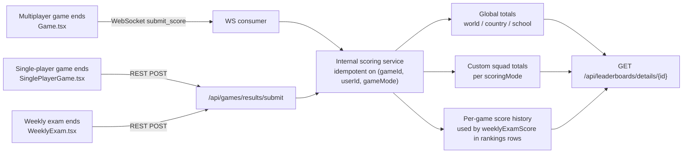
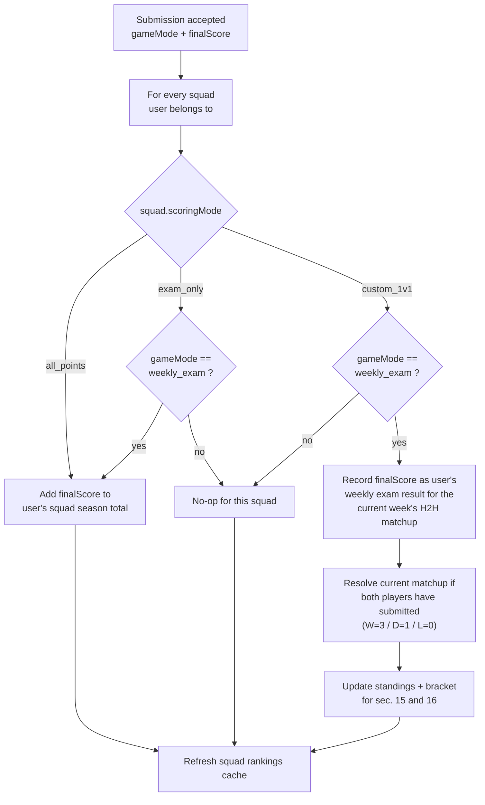

# Backend Ranking Updates — Handoff

This document is an **additive** spec aimed at the backend dev. It captures three related changes that together fix the issue where players cannot see their own results in the league rankings and cannot see what they scored on the current Study Week's exam.

The canonical contract document is [BACKEND_ENDPOINTS_REQUIRED.md](BACKEND_ENDPOINTS_REQUIRED.md). It is **not edited** by this round of work. Instead, this doc supersedes or extends the following sections in it:

| Existing section                                                                | Status in this update                                                              |
| ------------------------------------------------------------------------------- | ---------------------------------------------------------------------------------- |
| Sec. 5 — `GET /api/leaderboards/details/{id}`                                   | **Extended** (Section 3 below adds a `weeklyExamScore` field per `rankings[]` row) |
| Sec. 6 — `POST /api/games/single-player/submit`                                 | **Replaced + Fix required** (Sections 1 and 2 below)                               |
| Sec. 11 — `POST /api/weekly-exam/submit`                                        | **Replaced** by Section 1 below (universal submit endpoint)                        |
| Sec. 9–10, 12–16 (Weekly Exam status / H2H Battles / Knockout / Custom 1v1)     | Unchanged contract, but write path now routes through Section 1                    |

**Glossary.** "Ranking side" in this doc = the data surfaced by `GET /api/leaderboards/rankings/summary` and `GET /api/leaderboards/details/{id}`. "Squad" and "league" are used interchangeably with "custom leaderboard" (`/api/leaderboards/custom`).

## Why this exists (the bug we are fixing)

1. A user who creates a new custom league and opens it via the Play tab does not see themselves in the league rankings, even though `Squad Settings` lists them as a member. Root cause: the rankings query only includes users who already have a score record this season; a fresh creator has none yet.
2. Players cannot see the exact score they got for a particular game — single-player submissions never make it to the ranking side, so the number a player just saw on the post-game screen is not reflected anywhere persistent.
3. Within a league, players want to see this week's weekly-exam score for every member — including peers who haven't taken it yet (so they can chase them).

The three sections below address those three problems.

## High-level architecture



The REST endpoint in Section 1 and the existing multiplayer WebSocket handler MUST converge on the same internal scoring service so a write from either channel produces identical state.

---

## Section 1 — `POST /api/games/results/submit` (universal end-of-game submit)

Replaces sec. 6 and sec. 11 of [BACKEND_ENDPOINTS_REQUIRED.md](BACKEND_ENDPOINTS_REQUIRED.md). This is the single REST entry point that any completed game must hit at end of round.

### Endpoint

`POST /api/games/results/submit`

### Headers

- `Authorization: Token <user_token>` — required.

### Request body

```json
{
  "gameId": "game-uuid-or-id",
  "gameMode": "single_player",
  "finalScore": 1250,
  "highestStreak": 7
}
```

| Field           | Type             | Required | Description                                                                                                                       |
| --------------- | ---------------- | -------- | --------------------------------------------------------------------------------------------------------------------------------- |
| `gameId`        | `string`         | Yes      | Game/session ID for `single_player` and `multiplayer`. Weekly-exam ID for `weekly_exam`. Part of the idempotency key.             |
| `gameMode`      | `string` (enum)  | Yes      | One of `"single_player"`, `"multiplayer"`, `"weekly_exam"`.                                                                       |
| `finalScore`    | `integer`        | Yes      | Non-negative. The value the user is told they scored for this game; this is what will be persisted and displayed.                 |
| `highestStreak` | `integer`        | No       | Non-negative. Longest consecutive-correct streak in this session. Used by `GET /api/user/stats` (`streakAvg`).                    |

### Response 200

```json
{
  "success": true,
  "gameScore": 1250,
  "newTotalScore": 15800
}
```

| Field           | Type      | Description                                                                                                          |
| --------------- | --------- | -------------------------------------------------------------------------------------------------------------------- |
| `success`       | `boolean` | Always `true` on a 200. Errors use non-2xx status codes.                                                             |
| `gameScore`     | `integer` | The exact score accepted for THIS game, echoed back so the post-game screen can confirm "you scored X" without a refetch. |
| `newTotalScore` | `integer` | The user's accumulated **current-season** global total after this submission. Drives `userStatus` for `world`.       |

### Errors

| Status | When                                                                                                  |
| ------ | ----------------------------------------------------------------------------------------------------- |
| 400    | Missing field, negative `finalScore`, unknown `gameMode`, or `gameId` not parseable.                  |
| 403    | `gameId` does not include the authenticated user as a legitimate participant for the given `gameMode`. |
| 409    | Duplicate submission for `(gameId, userId, gameMode)`. Body MUST still echo the previously-stored `gameScore` and `newTotalScore` so the client can recover safely without a re-fetch. |

### Propagation rules (single DB transaction)

On a successful 200, the backend MUST apply the following updates atomically:

1. **Global totals (world / country / school).** Add `finalScore` to the user's current-season total. This is what `GET /api/leaderboards/rankings/summary` and `GET /api/leaderboards/details/{world|country|school}` read from. The season active at the server clock when the request is processed is the one credited.

2. **Per-squad propagation.** For each custom squad the user belongs to, branch by `squad.scoringMode`. **Important:** `custom_1v1` (H2H League) follows the same exam-only gate as `exam_only` — only `gameMode = "weekly_exam"` submissions affect it. Single-player and multiplayer scores never touch an H2H League's matchup or standings.



3. **H2H League details (`custom_1v1`) — explicit rules, no ambiguity:**
   - The matchup score for week `N` **IS** the user's weekly exam score for week `N`. It is not derived from any other game mode and it is not a running sum across modes — it is exactly the value the user submits with `gameMode = "weekly_exam"`.
   - If the user does not submit a weekly exam by the week's `endsAt`, their matchup score for that week is `0` (consistent with Section 3's "did not participate = 0" rule).
   - When both players in a pairing have a finalized score for the week, resolve the matchup: higher score wins (3 pts), tie is a draw (1 pt each), lower loses (0 pts). These pts feed the standings returned by `GET /api/h2h/custom/{squadId}/standings` (see sec. 16 of [BACKEND_ENDPOINTS_REQUIRED.md](BACKEND_ENDPOINTS_REQUIRED.md) and the `CustomH2HStanding` interface in `Mock/services/LeaderboardApiCalls.ts` lines 106–116).
   - Single-player and multiplayer game submissions are explicit **no-ops** for `custom_1v1` squads, even though the user is technically a member.

4. **Idempotency.** `(gameId, userId, gameMode)` is unique. Re-posts are no-ops that return the same 200 body (same `gameScore`, same `newTotalScore`). For weekly-exam re-submissions specifically, once both sides of a pairing have a recorded score the H2H matchup is **locked** — a late retry must NOT re-resolve the matchup or change the standings pts.

5. **Authorization.** The server validates that the authenticated user is a legitimate participant of `gameId` for the declared `gameMode`:
   - `single_player` → `game.user == requester`.
   - `multiplayer`   → requester is a participant of `gameId`.
   - `weekly_exam`   → requester is enrolled in that week's exam.

6. **Membership-as-rank seed.** Restating the contract already in [BACKEND_ENDPOINTS_REQUIRED.md](BACKEND_ENDPOINTS_REQUIRED.md) lines 833–834: every squad member MUST appear in `rankings[]` even at score 0. For `custom_1v1` squads this applies to the standings table in sec. 16, not to a cumulative ladder.

### Multiplayer note (WebSocket co-existence)

Multiplayer continues to write via the existing WebSocket `submit_score` message (see `Mock/app/(game)/Game.tsx` line 420). The WS handler MUST call the same internal scoring service that backs this REST endpoint so REST and WS converge on identical idempotent state. The REST endpoint also acts as the **recovery path** when the WS disconnects before `all_scores_submitted` fires — the mobile client may retry via REST with the same `gameId` and the 409/200 idempotency contract above guarantees no double-count.

---

## Section 2 — Fix the single-player submission (currently broken)

**FLAG: This is a discrete bug. Please fix it as part of this milestone even if Section 1 is staged for later.**

### Symptom

End-of-single-player-game submissions are not landing on the ranking side. After a user completes a solo game:

- Their world / country / school totals do not change.
- They remain invisible in their own newly-created league rankings (this is the user-facing complaint that triggered this whole doc).
- The post-game screen shows a score, but the same score is nowhere to be found if the user navigates away and comes back.

### Channel — REST only, NOT WebSocket

Please do not assume single-player uses the same path as multiplayer. They are different:

- **Multiplayer** uses WebSocket `submit_score` (`Mock/app/(game)/Game.tsx` line 420). It needs WS because the game waits for all participants' scores before transitioning to results.
- **Single-player** is REST only — there is no other player to wait for. The frontend already POSTs to `/api/games/single-player/submit` from `Mock/app/(game)/SinglePlayerGame.tsx` line 151. That POST is what is failing today.

### Resolution path (pick one — they end up equivalent)

- **Preferred.** Implement `POST /api/games/results/submit` from Section 1 and route the existing `/api/games/single-player/submit` handler internally through the same scoring service. The mobile client will be migrated to the new endpoint as a separate follow-up ticket.
- **Minimum.** Keep `/api/games/single-player/submit` as it is documented in sec. 6 of [BACKEND_ENDPOINTS_REQUIRED.md](BACKEND_ENDPOINTS_REQUIRED.md), but actually:
  1. persist the score,
  2. increment the user's current-season global total,
  3. apply the Section 1 per-squad propagation rules to every squad the user is in (treat the call as `gameMode = "single_player"`).

Either way, the propagation rules in Section 1 are the source of truth — do not invent a separate set just for the legacy endpoint.

### Acceptance test

1. New user creates a custom squad with `scoringMode = "all_points"`.
2. They play and complete one solo game with `finalScore = 200`.
3. The frontend hits `POST /api/games/single-player/submit` (or `POST /api/games/results/submit` once migrated).
4. After that single POST:
   - `GET /api/leaderboards/details/{customSquadId}` includes the user in `rankings[]` with `score >= 200`.
   - `GET /api/leaderboards/rankings/summary` returns non-null `world`, `country`, and `school` ranks for the user.
   - Replaying the same `gameId` returns 200 with unchanged totals (idempotent), not a double-count.

---

## Section 3 — Add `weeklyExamScore` to league rankings rows

Extension to `GET /api/leaderboards/details/{id}` for **custom squad IDs** (the global `world` / `country` / `school` lists are unaffected by this section). Each item in `rankings[]` gains one new field.

### Updated `rankings[]` row shape

```json
{
  "id": 1,
  "rank": 1,
  "username": "Alex Johnson",
  "avatarUrl": "https://...",
  "score": 9850,
  "badge": "Top Scholar",
  "movement": "up",
  "weeklyExamScore": 1340
}
```

### Semantics for `weeklyExamScore`

| Backend state                                                                       | Value to return | Frontend display intent                  |
| ----------------------------------------------------------------------------------- | --------------- | ---------------------------------------- |
| Current Study Week's exam has **not yet started** (server clock < `startsAt`)        | `null`          | Render as `—` / column may be hidden     |
| Exam window is open or already ended AND user **did not participate**                | `0`             | Render literally `0` so peers can see it |
| User submitted the weekly exam                                                       | actual score    | Render numeric                            |

### Important rules for the backend dev

- `weeklyExamScore` reflects the **current** Study Week's exam, not a cumulative or historical figure. It rolls over each week at the cadence already described in sec. 9 of [BACKEND_ENDPOINTS_REQUIRED.md](BACKEND_ENDPOINTS_REQUIRED.md).
- The source of truth is the same record updated by `gameMode = "weekly_exam"` submissions from Section 1. There is no separate write path; do not introduce one.
- "Not yet started" is detected exactly the same way `GET /api/weekly-exam/status` decides `isActive` — i.e. by comparing the server clock to the week's `startsAt`. If `startsAt` is in the future, return `null` for every member of the squad (it's a per-week property, not per-user).
- "Did not participate" is detected by the absence of a `weekly_exam` submission record for that `(userId, weekNumber)` after `startsAt` has passed. Return `0` (not `null`) — the distinction between "exam hasn't started" and "you skipped it" is the whole point.
- The field is also added to the canonical `rankings[]` shape documented at lines 751–798 of [BACKEND_ENDPOINTS_REQUIRED.md](BACKEND_ENDPOINTS_REQUIRED.md). Update the corresponding field-reference table there when the canonical doc is next revised.
- This field is **consistent with H2H Leagues**: for a `custom_1v1` squad, the value of `weeklyExamScore` IS the user's matchup score for the current week (same source). The same `null` / `0` / number semantics apply.
- No mobile changes are required for the field to be safely added — the existing TypeScript interface `RankingItem` in `Mock/services/LeaderboardApiCalls.ts` lines 28–36 ignores unknown keys. Frontend rendering will be a separate ticket once the backend ships.

---

## Out of scope

- Editing the existing [BACKEND_ENDPOINTS_REQUIRED.md](BACKEND_ENDPOINTS_REQUIRED.md). This document is additive; the superseded sections (6, 11) and the extended section (5) will be retired or merged in a future canonical-doc cleanup once the backend changes here are live.
- Implementing any of this in the mobile app. Frontend wiring (a new `submitGameResult` in `Mock/services/GamesApiCalls.ts`, rendering the `weeklyExamScore` column, and migrating `SinglePlayerGame.tsx` / `Game.tsx` / `WeeklyExam.tsx` to the new endpoint) is a follow-up ticket on the mobile side.
- Returning rank-deltas, motivational messages, or `h2hResult` payloads in the submit response. The response is intentionally minimal (`success` + `gameScore` + `newTotalScore`); clients that need richer post-game UI refetch `GET /api/leaderboards/details/{id}` and `GET /api/h2h/current` as needed.

---

## Section 4 — Add `userRank` to the custom squad list

Extension to `GET /api/leaderboards/custom`. Each item in the response gains one new field so the Play tab can show the requesting user's rank on every squad card without making a per-squad detail call.

### Updated item shape

```json
{
  "id": "ck123",
  "name": "Saturday Striders",
  "memberCount": 17,
  "scoringMode": "all_points",
  "invite_code": "ABC123",
  "isCodePublic": true,
  "isCreator": false,
  "userRank": 4
}
```

### Semantics for `userRank`

| Squad state                                                                                    | Value to return | Frontend display intent                       |
| ---------------------------------------------------------------------------------------------- | --------------- | --------------------------------------------- |
| User has a current rank in this squad's ladder                                                  | actual rank (1-based integer) | Render as `#4` with a minus indicator         |
| User is a member but unranked (e.g. brand-new squad, no scores yet, or pre-season)              | `null`          | Render as `—`                                  |
| Squad's current Study Week / H2H matchup has not started yet                                    | `null`          | Render as `—`                                  |

### Rank source per scoring mode

The rank must come from the **same ladder** the user lands on when they tap the squad card and open `GET /api/leaderboards/details/{id}`. Concretely:

- **`all_points`** → score-ordered ladder (same source as the existing `userStatus.rank` returned by the details endpoint). Use lifetime / season-cumulative score, depending on the timeframe the details endpoint currently uses for that squad.
- **`exam_only`** → score-ordered ladder restricted to weekly-exam submissions only (same source as `userStatus.rank` for an `exam_only` squad). Same selection rule the details endpoint already uses.
- **`custom_1v1`** → pts-ordered standings ladder, i.e. the same ranking returned by `GET /api/h2h/custom/{squadId}/standings`. The user's `rank` field on that response is the source of truth.

In every case `userRank` MUST equal the user's `rank` field on the matching detail / standings response. If those two values can ever diverge, it's a backend bug.

### Important rules for the backend dev

- `userRank` is per-requesting-user. It is not the same value for every caller — each user gets their own rank slotted into the response.
- This field is added to every item in `GET /api/leaderboards/custom` regardless of scoring mode; the **source** changes per mode (see above), the field name does not.
- Returning `null` is mandatory when the user is unranked. Do not return `0`, `-1`, or omit the field — the frontend distinguishes "unranked" (`null`) from "ranked #0" / "ranked #1" by exactly this signal.
- No new endpoints are required. This is a pure extension to the existing list response. No additional query params, no auth changes, no pagination changes.
- No mobile changes are required for the field to be safely added — the TypeScript interface `CustomLeaderboard` in `Mock/services/LeaderboardApiCalls.ts` already declares `userRank?: number | null` (frontend will start rendering it as soon as the backend ships).

### QA checklist

- A user who has just created a fresh squad sees `userRank = null` on the Play tab card.
- A user who is ranked #3 in an `all_points` squad sees `userRank = 3` on the Play tab; tapping the card and reading `userStatus.rank` from the details endpoint also returns `3`.
- A user who is ranked #2 in an `exam_only` squad sees `userRank = 2` on the Play tab; the details endpoint agrees.
- A user who is ranked #1 in an H2H (`custom_1v1`) squad sees `userRank = 1` on the Play tab; `GET /api/h2h/custom/{squadId}/standings` returns the same `rank`.
- During a pre-season / pre-week window where the squad has not started scoring yet, every member sees `userRank = null`.
